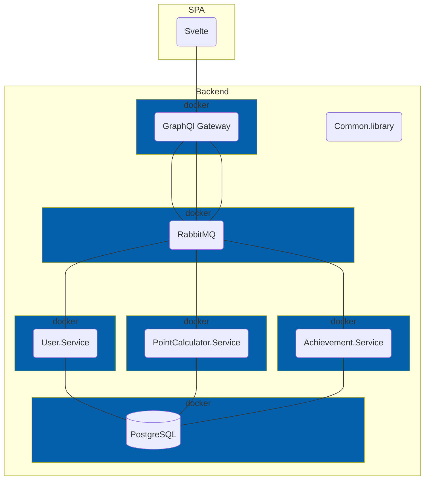

General ide for the project

```mermaid
    flowchart BT
        subgraph SPA
        A(Svelte)        
        end
        
        subgraph Backend 
        
            subgraph docker.gql [docker]
            gql(GraphQl Gateway)
            end

            subgraph docker.user [docker]
            C(User.Service)
            end
            
            subgraph docker.calculator [docker]
            D(PointCalculator.Service)
            end

            subgraph docker.achievemnt [docker]
            E(Achievement.Service)
            end
            
            subgraph docker.Postgre [docker]
            G[(PostgreSQL)]
            end

            subgraph docker.Rabbit [docker]
            H(RabbitMQ)
            end

        F(Common.library)
        end
        G --- C
        G --- D
        G --- E

        gql --- A 
              
        H ---- gql
        H ---- gql
        H ---- gql

        C ---- H
        D ---- H
        E ---- H
        
docker.user:::dockerClass
docker.calculator:::dockerClass
docker.achievemnt:::dockerClass
docker.Postgre:::dockerClass
docker.Rabbit:::dockerClass
docker.gql:::dockerClass

classDef dockerClass fill:#0560ab,text-align:left
        
```