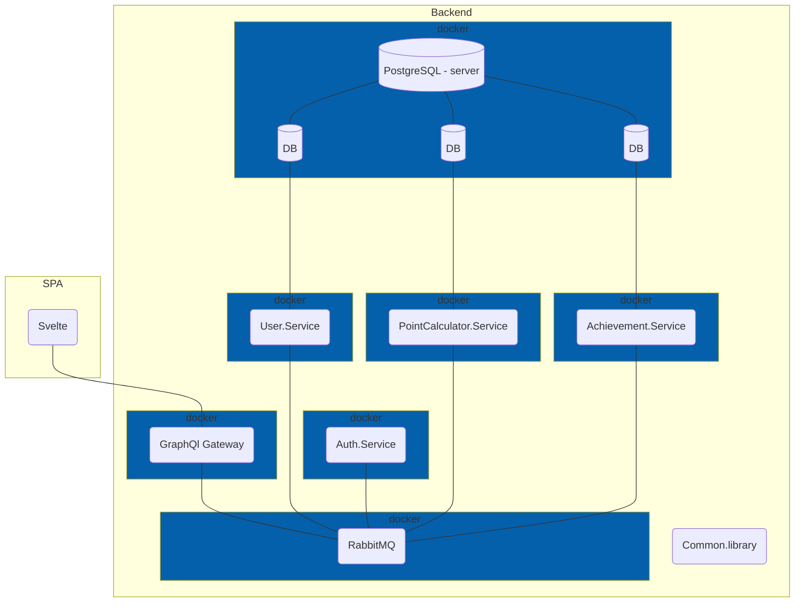

General idea for the project

```mermaid
    flowchart TD
        subgraph SPA
        A(Svelte)        
        end
        
        subgraph Backend 
        
            subgraph docker.gql [docker]
            gql(GraphQl Gateway)
            end

            subgraph docker.user [docker]
            C(User.Service)
            end

            subgraph docker.auth [docker]
            C.A(Auth.Service)
            end
            
            subgraph docker.calculator [docker]
            D(PointCalculator.Service)
            end

            subgraph docker.achievemnt [docker]
            E(Achievement.Service)
            end

            subgraph docker.Rabbit [docker]
            H(RabbitMQ)
            end

            
            subgraph docker.Postgre [docker]
            DB[(PostgreSQL - server)]
            C.DB[(DB)]
            D.DB[(DB)]
            E.DB[(DB)]
            end

        F(Common.library)
        end

        gql --- H
        
        A --- gql


        C ---- H
        C.A --- H 
        D ---- H
        E ---- H

        E.DB ----- E
        D.DB ----- D
        C.DB ----- C

        DB---C.DB
        DB---D.DB
        DB---E.DB
              
        
docker.user:::dockerClass
docker.calculator:::dockerClass
docker.achievemnt:::dockerClass
docker.Postgre:::dockerClass
docker.Rabbit:::dockerClass
docker.gql:::dockerClass
docker.auth:::dockerClass

classDef dockerClass fill:#0560ab,text-align:left
        
```